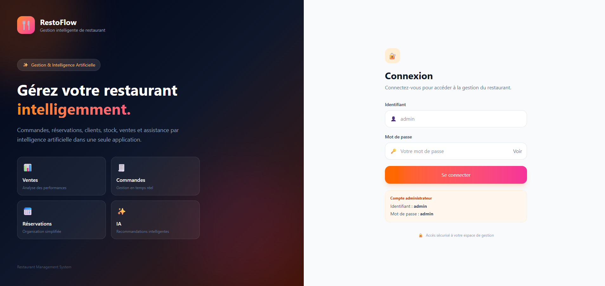
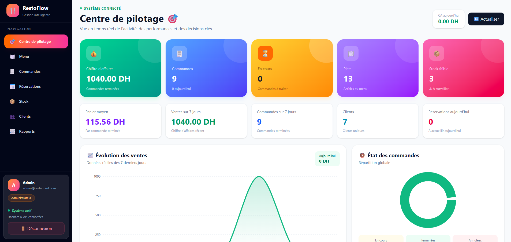
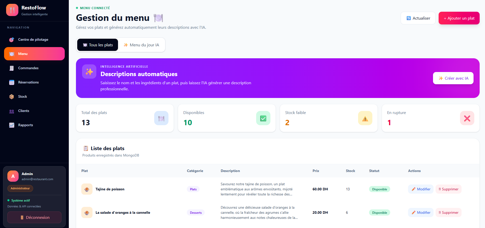
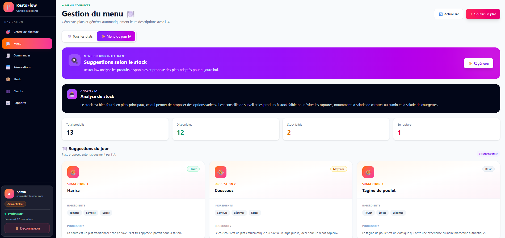
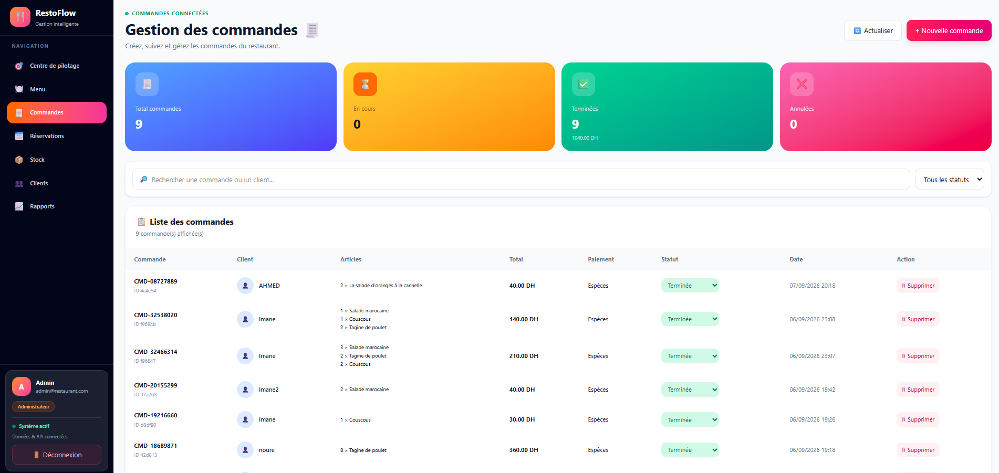
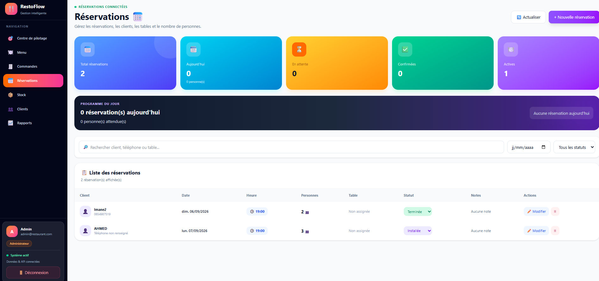
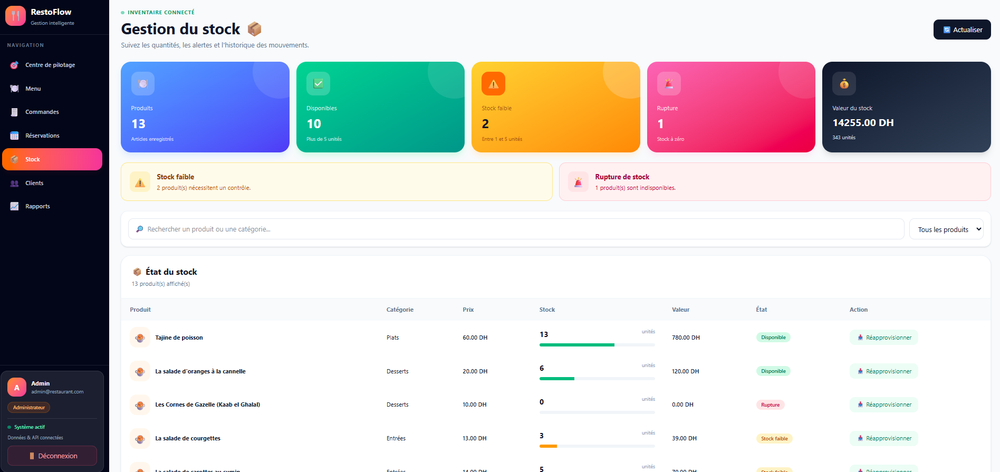
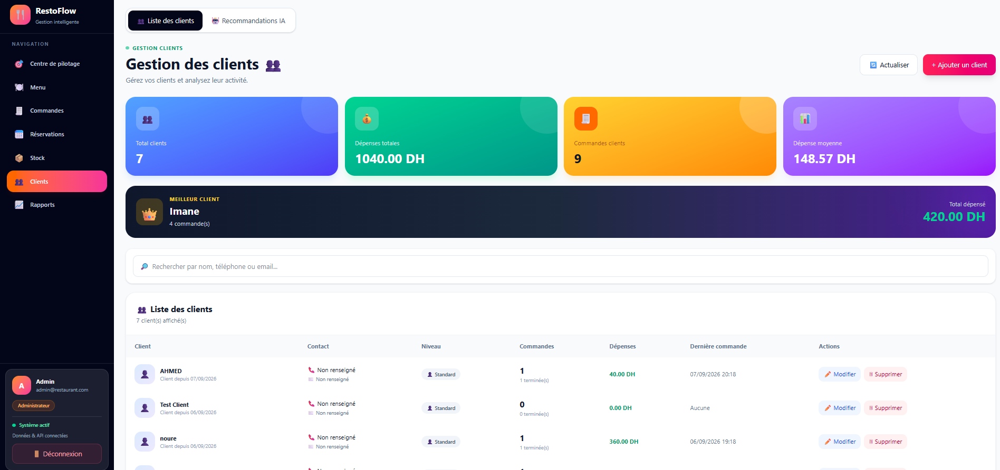
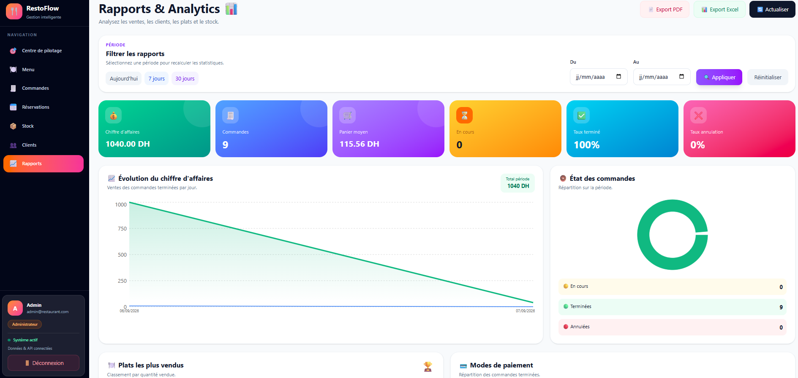
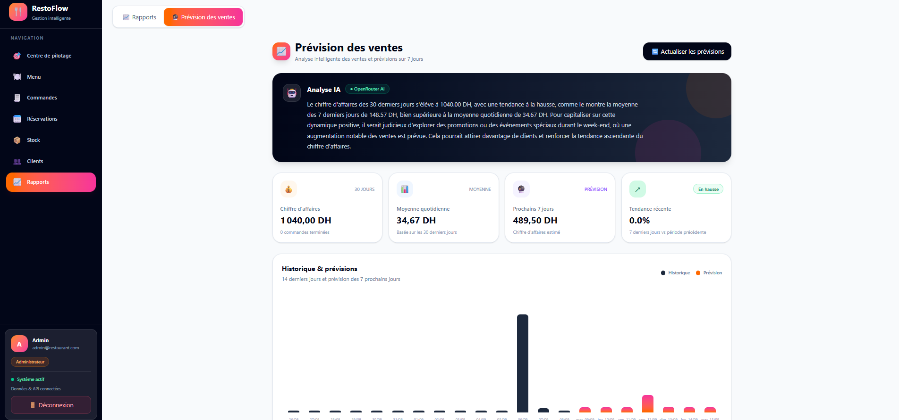

# 🍽️ RestoFlow

<div align="center">

## Intelligent Restaurant Management System
### Système intelligent de gestion de restaurant
### نظام ذكي لإدارة المطاعم

**Manage smarter • Gérez intelligemment • إدارة أكثر ذكاءً**

<br>

[](https://react.dev/)
[](https://nodejs.org/)
[](https://www.mongodb.com/)
[](https://vercel.com/)
[](https://railway.app/)

### 🌐 [Live Demo / Démo / تجربة مباشرة](https://resto-flow-tawny.vercel.app/)

**🇬🇧 English • 🇫🇷 Français • 🇲🇦 العربية**

</div>

---

# 📖 About / À propos / حول المشروع

### 🇬🇧 English

**RestoFlow** is a full-stack intelligent restaurant management platform designed to centralize restaurant operations in one modern application.

It combines restaurant management, analytics and artificial intelligence to help manage menus, orders, reservations, inventory, customers and sales.

### 🇫🇷 Français

**RestoFlow** est une plateforme intelligente Full-Stack conçue pour centraliser la gestion quotidienne d'un restaurant dans une seule application moderne.

Elle combine la gestion du restaurant, l'analyse des données et l'intelligence artificielle pour gérer les menus, les commandes, les réservations, le stock, les clients et les ventes.

### 🇲🇦 العربية

**RestoFlow** هو نظام ذكي متكامل لإدارة المطاعم، تم تطويره لتجميع مختلف العمليات اليومية للمطعم داخل تطبيق حديث واحد.

يجمع النظام بين إدارة المطعم، تحليل البيانات والذكاء الاصطناعي، مما يسمح بإدارة قائمة الطعام، الطلبات، الحجوزات، المخزون، العملاء والمبيعات.

---

# 🖥️ Application Preview / Aperçu / صور التطبيق

## 🔐 Authentication / Connexion / تسجيل الدخول

**🇬🇧** Secure access to the restaurant management platform.

**🇫🇷** Accès sécurisé à la plateforme de gestion du restaurant.

**🇲🇦** تسجيل دخول آمن إلى نظام إدارة المطعم.



---

## 🎯 Dashboard / Tableau de bord / لوحة التحكم

**🇬🇧** A real-time overview of revenue, orders, dishes, inventory, customers and reservations.

**🇫🇷** Une vue en temps réel du chiffre d'affaires, des commandes, des plats, du stock, des clients et des réservations.

**🇲🇦** نظرة شاملة وفورية على المبيعات والطلبات والأطباق والمخزون والعملاء والحجوزات.



---

## 🍽️ Menu Management / Gestion du menu / إدارة قائمة الطعام

**🇬🇧** Create and manage dishes, categories, descriptions, prices, availability and stock.

**🇫🇷** Créez et gérez les plats, catégories, descriptions, prix, disponibilités et stocks.

**🇲🇦** إنشاء وإدارة الأطباق والتصنيفات والأوصاف والأسعار والتوفر والمخزون.



---

## 🤖 AI Menu Suggestions
### Suggestions de menu par IA
### اقتراحات قائمة الطعام بالذكاء الاصطناعي

**🇬🇧** RestoFlow analyzes available inventory and generates intelligent menu suggestions.

**🇫🇷** RestoFlow analyse le stock disponible et génère automatiquement des suggestions de plats adaptées.

**🇲🇦** يقوم RestoFlow بتحليل المخزون المتوفر واقتراح أطباق مناسبة تلقائياً باستخدام الذكاء الاصطناعي.



---

## 🧾 Order Management / Gestion des commandes / إدارة الطلبات

**🇬🇧** Create, search and track restaurant orders, payments and statuses.

**🇫🇷** Créez, recherchez et suivez les commandes, les paiements et leur statut.

**🇲🇦** إنشاء وتتبع والبحث عن طلبات المطعم مع متابعة حالة الطلب وطريقة الدفع.



---

## 📅 Reservations / Réservations / الحجوزات

**🇬🇧** Manage reservations, dates, times, customers, number of guests and reservation status.

**🇫🇷** Gérez les réservations, les dates, les horaires, les clients, le nombre de personnes et les statuts.

**🇲🇦** إدارة الحجوزات والعملاء والتاريخ والوقت وعدد الأشخاص وحالة كل حجز.



---

## 📦 Inventory / Gestion du stock / إدارة المخزون

**🇬🇧** Monitor inventory quantities, low-stock products, shortages and total stock value.

**🇫🇷** Surveillez les quantités, les produits en stock faible, les ruptures et la valeur totale du stock.

**🇲🇦** مراقبة كميات المنتجات والتنبيه عند انخفاض المخزون أو نفاده، مع حساب القيمة الإجمالية للمخزون.



---

## 👥 Customers / Clients / العملاء

**🇬🇧** Manage customers and analyze their orders, spending and activity.

**🇫🇷** Gérez les clients et analysez leurs commandes, leurs dépenses et leur activité.

**🇲🇦** إدارة العملاء وتحليل طلباتهم ومصاريفهم ونشاطهم داخل المطعم.



---

## 📊 Reports & Analytics
### Rapports & Analyses
### التقارير والتحليلات

**🇬🇧** Analyze revenue, orders, average order value, sales evolution and restaurant performance.

**🇫🇷** Analysez le chiffre d'affaires, les commandes, le panier moyen, l'évolution des ventes et les performances du restaurant.

**🇲🇦** تحليل رقم المعاملات والطلبات ومتوسط قيمة الطلب وتطور المبيعات وأداء المطعم.

The reports can be exported to **PDF** and **Excel**.

Les rapports peuvent être exportés en **PDF** et **Excel**.

يمكن تصدير التقارير بصيغتي **PDF** و **Excel**.



---

# 🔮 AI Sales Forecast
## Prévision des ventes par IA
## توقع المبيعات بالذكاء الاصطناعي

**🇬🇧**

RestoFlow analyzes historical restaurant sales to generate:

- Revenue analysis
- Daily averages
- 7-day forecasts
- Sales trends
- AI-generated recommendations

**🇫🇷**

RestoFlow analyse l'historique des ventes afin de générer :

- Analyse du chiffre d'affaires
- Moyennes quotidiennes
- Prévisions sur 7 jours
- Tendances des ventes
- Recommandations générées par IA

**🇲🇦**

يقوم RestoFlow بتحليل بيانات المبيعات السابقة من أجل توفير:

- تحليل رقم المعاملات
- متوسط المبيعات اليومية
- توقعات المبيعات للأيام السبعة القادمة
- تحليل اتجاه المبيعات
- توصيات ذكية مبنية على البيانات



---

# ✨ Features / Fonctionnalités / المميزات

| | English | Français | العربية |
|---|---|---|---|
| 🎯 | Dashboard | Tableau de bord | لوحة التحكم |
| 🍽️ | Menu Management | Gestion du menu | إدارة قائمة الطعام |
| ✨ | AI Dish Descriptions | Descriptions par IA | وصف الأطباق بالذكاء الاصطناعي |
| 🤖 | AI Menu Suggestions | Suggestions de menu IA | اقتراح الأطباق بالذكاء الاصطناعي |
| 🧾 | Order Management | Gestion des commandes | إدارة الطلبات |
| 📅 | Reservations | Gestion des réservations | إدارة الحجوزات |
| 📦 | Inventory | Gestion du stock | إدارة المخزون |
| 👥 | Customer Management | Gestion des clients | إدارة العملاء |
| 📊 | Analytics | Rapports & analyses | التقارير والتحليلات |
| 🔮 | Sales Forecast | Prévision des ventes | توقع المبيعات |
| 📄 | PDF Export | Export PDF | تصدير PDF |
| 📗 | Excel Export | Export Excel | تصدير Excel |

---

# 🤖 Artificial Intelligence
## Intelligence Artificielle
## الذكاء الاصطناعي

RestoFlow integrates artificial intelligence into several parts of the application.

RestoFlow intègre l'intelligence artificielle dans plusieurs fonctionnalités de l'application.

يدمج RestoFlow الذكاء الاصطناعي في العديد من وظائف التطبيق.

### ✨ AI Dish Descriptions / Descriptions IA / وصف الأطباق

Generate professional dish descriptions automatically.

Génération automatique de descriptions professionnelles pour les plats.

إنشاء وصف احترافي للأطباق بشكل تلقائي.

### 🍽️ Smart Menu / Menu intelligent / القائمة الذكية

Generate menu suggestions based on available products.

Génération de suggestions selon les produits disponibles.

اقتراح أطباق اعتماداً على المنتجات المتوفرة في المخزون.

### 📦 Inventory Analysis / Analyse du stock / تحليل المخزون

Analyze available inventory and identify products requiring attention.

Analyse du stock et identification des produits nécessitant une attention particulière.

تحليل المخزون وتحديد المنتجات التي تحتاج إلى مراقبة.

### 🔮 Sales Forecasting / Prévision des ventes / توقع المبيعات

Analyze historical data and provide sales forecasts and business recommendations.

Analyse des données historiques afin de produire des prévisions et recommandations.

تحليل بيانات المبيعات السابقة وتقديم توقعات وتوصيات مستقبلية.

AI features are powered through the **OpenRouter API**.

---

# 🛠️ Technology Stack / Technologies / التقنيات

### 🎨 Frontend

- React
- Vite
- JavaScript
- CSS
- Recharts

### ⚙️ Backend

- Node.js
- Express.js
- REST API
- JWT Authentication

### 🗄️ Database / Base de données / قاعدة البيانات

- MongoDB
- MongoDB Atlas

### 🤖 Artificial Intelligence

- OpenRouter API

### ☁️ Deployment / Déploiement / الاستضافة

- **Vercel** — Frontend
- **Railway** — Backend
- **MongoDB Atlas** — Database
- **GitHub** — Source Control

---

# 🏗️ Architecture

```text
                 ┌──────────────────┐
                 │       User       │
                 │   Utilisateur    │
                 │     المستخدم     │
                 └────────┬─────────┘
                          │
                          ▼
                 ┌──────────────────┐
                 │   React + Vite   │
                 │     Frontend     │
                 │      Vercel      │
                 └────────┬─────────┘
                          │
                       REST API
                          │
                          ▼
                 ┌──────────────────┐
                 │     Node.js      │
                 │     Express      │
                 │     Railway      │
                 └────────┬─────────┘
                          │
              ┌───────────┴───────────┐
              │                       │
              ▼                       ▼
       ┌──────────────┐        ┌──────────────┐
       │   MongoDB    │        │  OpenRouter  │
       │    Atlas     │        │      AI      │
       └──────────────┘        └──────────────┘
```

---

# 📂 Project Structure / Structure / بنية المشروع

```text
RestoFlow/
│
├── backend/
│
├── frontend/
│   └── src/
│       ├── pages/
│       ├── components/
│       ├── context/
│       └── config/
│
├── restoflow-screenshots/
│   ├── 01-login.png
│   ├── 02-dashboard.png
│   ├── 03-menu.png
│   ├── 04-ai-menu.png
│   ├── 05-orders.png
│   ├── 06-reservations.png
│   ├── 07-stock.png
│   ├── 08-clients.png
│   ├── 09-analytics.png
│   └── 10-ai-sales-forecast.png
│
├── .gitignore
└── README.md
```

---

# 🚀 Installation

### 1️⃣ Clone / Cloner / استنساخ المشروع

```bash
git clone https://github.com/medfree2/RestoFlow.git
cd RestoFlow
```

### 2️⃣ Backend

```bash
cd backend
npm install
node server.js
```

### 3️⃣ Frontend

Open another terminal:

```bash
cd frontend
npm install
npm run dev
```

---

# 🔐 Environment Variables
## Variables d'environnement
## متغيرات البيئة

Backend:

```env
MONGODB_URI=your_mongodb_connection_string
JWT_SECRET=your_jwt_secret
OPENROUTER_API_KEY=your_openrouter_api_key
```

Frontend:

```env
VITE_API_URL=your_backend_api_url
```

> ⚠️ **Never publish `.env`, API keys, database credentials or JWT secrets.**
>
> **Ne publiez jamais vos clés API, identifiants de base de données ou secrets JWT.**
>
> **لا تقم أبداً بنشر مفاتيح API أو بيانات الاتصال بقاعدة البيانات أو المفاتيح السرية.**

---

# 🌐 Live Application / Application en ligne / التطبيق

### 🖥️ Frontend

https://resto-flow-tawny.vercel.app/

### ⚙️ Backend API

https://restoflow-production-c50d.up.railway.app/

---

# 🎯 Project Goals / Objectifs / أهداف المشروع

### 🇬🇧

RestoFlow demonstrates the development of a complete modern application combining full-stack development, data analysis, artificial intelligence and cloud deployment.

### 🇫🇷

RestoFlow démontre le développement d'une application moderne complète combinant le développement Full-Stack, l'analyse de données, l'intelligence artificielle et le déploiement Cloud.

### 🇲🇦

يهدف مشروع RestoFlow إلى تطبيق مجموعة من التقنيات الحديثة داخل مشروع متكامل يجمع بين تطوير Full-Stack، تحليل البيانات، الذكاء الاصطناعي والاستضافة السحابية.

---

# 🔮 Future Improvements
## Améliorations futures
## تطويرات مستقبلية

- 👨‍🍳 Employee Management / Gestion des employés / إدارة الموظفين
- 🪑 Table Management / Gestion des tables / إدارة الطاولات
- 🧾 Invoice Generation / Génération de factures / إنشاء الفواتير
- 💳 Online Payments / Paiement en ligne / الدفع الإلكتروني
- 🔔 Real-time Notifications / Notifications en temps réel / إشعارات فورية
- 📱 Improved Mobile Experience / Version mobile améliorée / تحسين نسخة الهاتف
- 📈 Advanced Forecasting / Prévisions avancées / توقعات متقدمة
- 🧠 Advanced AI Recommendations / Recommandations IA avancées / توصيات ذكية متقدمة
- 🌍 Multi-language Support / Support multilingue / دعم عدة لغات
- 🏪 Multi-restaurant Support / Gestion multi-restaurants / إدارة عدة مطاعم

---

# 👨‍💻 Author / Auteur / المطور

<div align="center">

## Noureddine Mohammed

**Full-Stack Development • Data • Artificial Intelligence**

---

### 🍽️ RestoFlow

**Manage smarter. Analyze better. Grow faster.**

**Gérez mieux. Analysez mieux. Progressez plus vite.**

**إدارة أذكى • تحليل أفضل • تطور أسرع**

<br>

⭐ **If you like RestoFlow, give the repository a star!**

⭐ **Si RestoFlow vous plaît, ajoutez une étoile au projet !**

⭐ **إذا أعجبك مشروع RestoFlow، يمكنك دعم المشروع بنجمة!**

</div>
